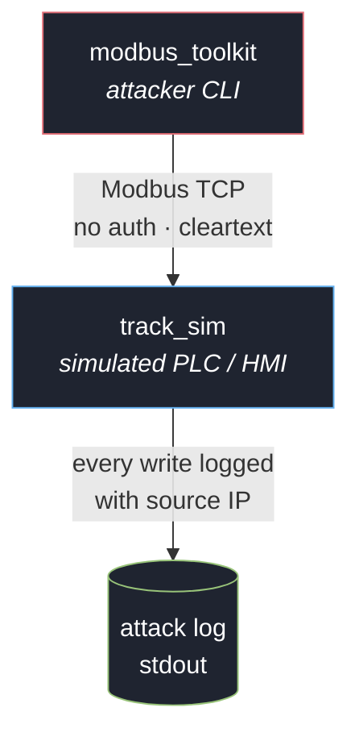

# ics-radar-toolkit

A Modbus TCP ICS attack toolkit and target simulator, built around a simplified
**track-management PLC** — the kind of controller that could sit between a
radar/sensor feed and an operator display (HMI) in a track-management
architecture. Written in C++ against [libmodbus](https://libmodbus.org/), the
library many real-world Modbus TCP integrations (including industrial and
research tooling) are built on.

This exists because unauthenticated Modbus TCP is still common in the field,
and the impact of that exposure is easier to reason about with a concrete,
runnable target than with slides. Everything here talks to a **bundled
simulator only** — there is no code in this repo that talks to real hardware
or a real network by default.

## Motivation

I built this as a first-year Cybersecurity student to go beyond CTF writeups
and build a real, working tool — something that demonstrates understanding of
a protocol and an attack class end-to-end, not just a solved challenge. ICS
security specifically connects to a longer-standing interest of mine in
network-centric and radar/air-defense-adjacent systems, which is why the
simulated target is framed as a track-management PLC rather than a generic
factory device.

## Real-world relevance

Modbus is widely used in industrial automation across sectors including
cement manufacturing, water treatment, and building automation — including
within Pakistan's growing industrial automation sector. The "track-management"
framing here is illustrative rather than a reproduction of a real air-defense
system (see Scope and ethics below), but the underlying protocol, data model,
and lack of authentication are exactly what's deployed in these real
industrial contexts today.

## Why this, and why this framing

Modbus TCP has no authentication or encryption in its base spec. That's not
a bug in a specific vendor's implementation — it's the protocol as designed
in 1979 and still deployed today. Given a network path to the PLC, any client
can read and write any exposed register or coil. This toolkit demonstrates
what that means concretely for a track-management-style target: an attacker
who can reach the PLC over the network can flip a hostile track to
"friendly," erase a real track from the operator's display, inject a track
that was never actually detected, or overwrite bearing/range/altitude/speed
data with no validation and no audit trail beyond what the target itself
happens to log.

## Architecture



See [`docs/register-map.md`](docs/register-map.md) for the full coil/register
layout and the threat model it maps to.

## Components

- **`simulator/track_sim.cpp`** — a Modbus TCP server simulating a
  track-management PLC: 4 tracks, each with active/inactive state, IFF
  friend/foe status, and bearing/range/altitude/speed. Logs every write it
  receives, tagged with the source IP, so it doubles as an attack log.
- **`toolkit/modbus_toolkit.cpp`** — the attack CLI:
  - `enumerate` — dump all coils, holding registers, and input registers
  - `spoof-iff <track> <0|1>` — flip a track's IFF friend/foe status
  - `spoof-track <track> <bearing> <range_x10> <alt_x10> <speed>` — overwrite
    a track's kinematic data with attacker-chosen values
  - `kill-track <track>` — clear a track's active flag, erasing a real
    contact from the display
  - `ghost-track <track>` — fabricate a track with no underlying sensor data
  - `fuzz <iterations>` — send malformed/out-of-range function-code requests
    and report which ones the target accepted when it shouldn't have

## Build

Requires `libmodbus-dev` and CMake.

```bash
sudo apt-get install libmodbus-dev cmake build-essential
mkdir build && cd build
cmake ..
make
```

## Run

Start the simulator in one terminal:

```bash
./build/track_sim 127.0.0.1 15020
```

Run the toolkit against it in another:

```bash
./build/modbus_toolkit 127.0.0.1 15020 enumerate
./build/modbus_toolkit 127.0.0.1 15020 spoof-iff 1 1
./build/modbus_toolkit 127.0.0.1 15020 kill-track 0
./build/modbus_toolkit 127.0.0.1 15020 ghost-track 3
./build/modbus_toolkit 127.0.0.1 15020 fuzz 200
```

Watch the simulator's terminal — every write is logged with the attacking
client's IP, so you can see the attack land on the "PLC" side in real time.

## Defensive notes

This same exercise motivates the standard Modbus/ICS mitigations, none of
which this toolkit implements bypasses for because the base protocol has no
such controls to bypass:

- Network segmentation — ICS/OT networks should not be reachable from IT or
  the internet; Modbus TCP has no business being routable outside a
  purpose-built OT segment
- Modbus-aware firewalls / DPI that enforce which function codes and
  register ranges a given client is allowed to touch
- Wrapping Modbus in an authenticated tunnel (e.g. VPN or a protocol gateway)
  since Modbus itself won't provide this
- Application-layer bounds checking on the PLC side — this simulator
  deliberately omits it (see the `fuzz` results) to mirror real deployments
  that also often omit it

## Scope and ethics

- This toolkit is built and tested only against the bundled simulator.
- The "track-management" framing is illustrative — it is not a reproduction
  of any real radar, IFF, or air-defense system, protocol, or product.
- Only run this against systems you own or are explicitly authorized to
  test. Unauthenticated Modbus TCP attacks against real ICS/SCADA
  infrastructure without authorization are illegal in most jurisdictions and
  can have physical-world safety consequences.
