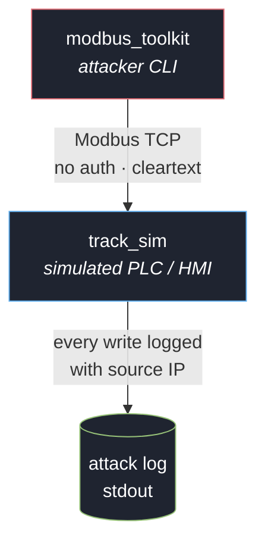
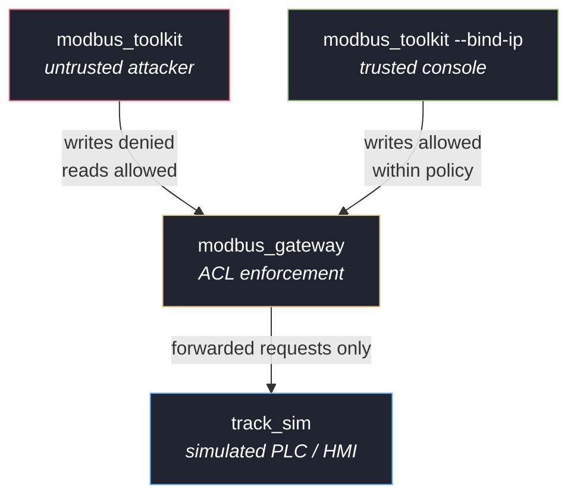

# ics-modbus-siege

A Modbus TCP ICS attack toolkit, defensive gateway, and target simulator,
built around a simplified **track-management PLC** — the kind of controller
that could sit between a sensor feed and an operator display (HMI) in an
industrial control system. Written in C++ against
[libmodbus](https://libmodbus.org/), the library many real-world Modbus TCP
integrations (including industrial and research tooling) are built on.

This exists because unauthenticated Modbus TCP is still common in the field,
and the impact of that exposure is easier to reason about with a concrete,
runnable target than with slides. Everything here talks to a **bundled
simulator only** — there is no code in this repo that talks to real hardware
or a real network by default.

## Motivation

I built this as a first-year Cybersecurity student to go beyond CTF writeups
and build a real, working tool — something that demonstrates understanding of
a protocol and an attack class end-to-end, not just a solved challenge. ICS
security specifically connects to a longer-standing interest of mine in
network-centric and radar/air-defense-adjacent systems, which is why the
simulated target is framed as a track-management PLC rather than a generic
factory device.

## Real-world relevance

Modbus TCP is a real, still-widely-deployed protocol — the mechanics
demonstrated here (unauthenticated enumeration, unauthorized writes,
fuzzing for missing bounds checks, access-control reconnaissance) transfer
directly to genuine Modbus deployments. The "track-management" framing is
illustrative rather than a reproduction of a real air-defense, radar, or
IFF system — see Scope and ethics below for what this project does and
does not represent.

**Where Modbus is actually deployed:**

- **Manufacturing plants generally** — cement, food processing, textiles,
  chemicals — anywhere PLCs control conveyor belts, mixers, kilns, or
  packaging lines. This is Modbus's original and still most common home,
  including within Pakistan's growing industrial automation sector.
- **Water/wastewater treatment** — pump stations, valve control
- **Building automation** — HVAC, access control, elevators in large
  facilities, including on military bases for general facility
  infrastructure — not weapons or radar systems
- **Drone manufacturing plants** — the factory floor building the drones
  (conveyor lines, assembly robots, quality-control stations) plausibly
  runs Modbus-based automation like any other manufacturing facility. A
  drone's own onboard flight systems are a separate, unrelated domain this
  project has nothing to do with.
- **Oil & gas, power distribution** — pipeline monitoring, some substation
  equipment

## Why this, and why this framing

Modbus TCP has no authentication or encryption in its base spec. That's not
a bug in a specific vendor's implementation — it's the protocol as designed
in 1979 and still deployed today. Given a network path to the PLC, any client
can read and write any exposed register or coil. This toolkit demonstrates
what that means concretely for a track-management-style target: an attacker
who can reach the PLC over the network can flip a hostile track to
"friendly," erase a real track from the operator's display, inject a track
that was never actually detected, or overwrite bearing/range/altitude/speed
data with no validation and no audit trail beyond what the target itself
happens to log.

## Architecture

**Level 1 — no defenses.** The toolkit talks directly to the simulated PLC.



**Level 2 — access-control gateway.** A proxy now sits in front of the PLC,
enforcing a source-IP + function-code + address-range whitelist on every
write. Reads stay open to anyone.



See [`docs/register-map.md`](docs/register-map.md) for the coil/register
layout, and [`docs/gateway-rules.md`](docs/gateway-rules.md) for the exact
Level 2 access-control policy.

## Components

- **`simulator/track_sim.cpp`** — a Modbus TCP server simulating a
  track-management PLC: 4 tracks, each with active/inactive state, IFF
  friend/foe status, and bearing/range/altitude/speed. Logs every write it
  receives, tagged with the source IP, so it doubles as an attack log.
- **`gateway/modbus_gateway.cpp`** — the Level 2 access-control proxy.
  Parses each Modbus TCP request at the wire level and enforces a
  source-IP + function-code + address-range whitelist before forwarding
  to `track_sim`, returning real Modbus exception codes on denial. See
  `docs/gateway-rules.md` for the exact policy.
- **`toolkit/modbus_toolkit.cpp`** — the attack CLI:
  - `enumerate` — dump all coils, holding registers, and input registers
  - `spoof-iff <track> <0|1>` — flip a track's IFF friend/foe status
  - `spoof-track <track> <bearing> <range_x10> <alt_x10> <speed>` — overwrite
    a track's kinematic data with attacker-chosen values
  - `kill-track <track>` — clear a track's active flag, erasing a real
    contact from the display
  - `ghost-track <track>` — fabricate a track with no underlying sensor data
  - `fuzz <iterations>` — send malformed/out-of-range function-code requests
    and report which ones the target accepted when it shouldn't have
  - `probe-acl` — map out a Level 2 gateway's write policy by testing a
    spread of addresses and classifying each response
  - `--bind-ip <ip>` — connect from a specific local source IP, to present
    as the trusted console against the Level 2 gateway

## Build

Requires `libmodbus-dev` and CMake.

```bash
sudo apt-get install libmodbus-dev cmake build-essential
mkdir build && cd build
cmake ..
make
```

## Run

**Level 1 — direct, no defenses:**

```bash
./build/track_sim 127.0.0.1 15020
```

```bash
./build/modbus_toolkit 127.0.0.1 15020 enumerate
./build/modbus_toolkit 127.0.0.1 15020 spoof-iff 1 1
./build/modbus_toolkit 127.0.0.1 15020 kill-track 0
./build/modbus_toolkit 127.0.0.1 15020 ghost-track 3
./build/modbus_toolkit 127.0.0.1 15020 fuzz 200
```

**Level 2 — through the access-control gateway:**

```bash
./build/track_sim 127.0.0.1 15020
./build/modbus_gateway 127.0.0.1 15021 127.0.0.1 15020
```

```bash
# Untrusted attacker — writes denied, reads still work
./build/modbus_toolkit 127.0.0.1 15021 probe-acl

# Trusted console — writes allowed within policy, still capped outside it
./build/modbus_toolkit --bind-ip 127.0.0.2 127.0.0.1 15021 probe-acl
```

Watch the gateway's terminal — it logs an ALLOW/DENY decision with the
reason for every request, so you can see the policy being enforced live.

## Defensive notes

Level 2 implements one real mitigation (an access-control gateway). The
rest of the standard Modbus/ICS mitigations this exercise motivates are
still not implemented here, since the point is to add them one at a time:

- Network segmentation — ICS/OT networks should not be reachable from IT or
  the internet; Modbus TCP has no business being routable outside a
  purpose-built OT segment
- Authentication beyond IP-based trust (IP addresses are spoofable in ways
  a real token/credential isn't) — see `docs/gateway-rules.md` for how the
  current gateway's trust model works and where it stops
- Wrapping Modbus in an authenticated, encrypted tunnel (e.g. TLS or a VPN)
  since Modbus itself provides neither
- Application-layer bounds checking on the PLC side — `track_sim`
  deliberately omits it (see the `fuzz` results) to mirror real deployments
  that also often omit it

## Scope and ethics

- This toolkit is built and tested only against the bundled simulator.
- The "track-management" framing is illustrative — it is not a reproduction
  of any real radar, IFF, or air-defense system, protocol, or product.
  Real air-defense, radar, and avionics systems use specialized, typically
  classified or hardened protocols with no resemblance to Modbus; nothing
  here is transferable to that domain.
- Only run this against systems you own or are explicitly authorized to
  test. Unauthenticated Modbus TCP attacks against real ICS/SCADA
  infrastructure without authorization are illegal in most jurisdictions and
  can have physical-world safety consequences.
